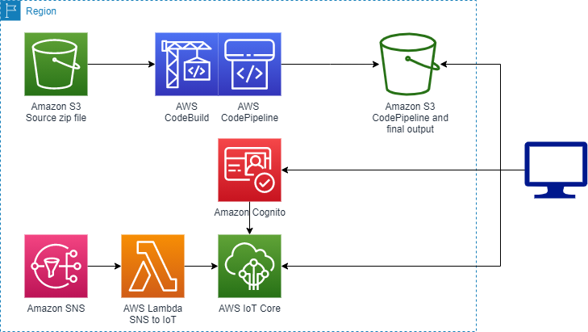

# sns_viewer
This is a simple viewer of SNS events that can be used to view Amazon SNS
messages as they are produced. The approach is as follows:
- IoT Core will be used to send messages to the webpage via MQTT
- A Lambda function will subscribe to the specified SNS topic and publish to the IoT Core topic
- The IoT Core endpoint will be protected with Cognito
- The webpage will be configured to read from the IoT Core endpoint and listen on the specified topic. It will present the notification messages in real time. The webpage is served from S3 via CloudFront.

In order for the webpage to be built with the necessary configuration parameters
(namely the IoT endpiont, the IoT topic name, etc), the webpage has been built in
Vue using parameters. A zip file of the source code is uploaded to an S3 bucket.
A CodePipeline will read the S3 zip file, execute a CodePipeline which builds the
webpage filling in the parameters, and publishes to an S3 bucket in a form that is
servable via CloudFront.

## Local Development
### Project setup
To install the necessary dependencies.
```
make install
```

### Compiles and hot-reloads for development
To run the webpage locally. Make sure to create a `.env.local` file containing
the following paremeters:
- VUE_APP_POOLID="The Cognito Identity Pool Id"
- VUE_APP_IOTENDPOINT="The IoT Endpoint for your account in your region"
- VUE_APP_AWSREGION="The AWS region you are running in"
- VUE_APP_IOTTOPIC="The IoT topic to listen to"

Then run:
```
make serve
```

### Compiles and minifies for production
To build the webpage - this is not a necessary step, but can be useful. It will
build into the `dist/` subdirectory. You will also need the `.env.local` file
containing the following parameters:
- VUE_APP_POOLID="The Cognito Identity Pool Id"
- VUE_APP_IOTENDPOINT="The IoT Endpoint for your account in your region"
- VUE_APP_AWSREGION="The AWS region you are running in"
- VUE_APP_IOTTOPIC="The IoT topic to listen to"

Then run:
```
make build
```

### Serves the built webpage
Serves the built webpage.
```
make serve_dist
```

## CloudFormation
This is a high-level view of the architecture in the CloudFormation template:


### Build zip file for upload to S3
To build the zip file for upload to S3, run:
```
make sns_viewer.zip
```

Upload this zip file to S3

### Using CloudFormation
A CloudFormation template is included in `cloudformation/sns_viewer.yaml`. It
take the following parameters:
- prefix: Prefix name to be prepended for resources (lowercase, numbers, and hyphen).
- S3SourceBucket: Bucket for the webpage source zip file
- S3SourceKey: Object key for the webpage source zip file
- SNSTopic: Description: SNS Topic Arn to subscribe to

It will output the hosted webpage URL as `Webpage`.
